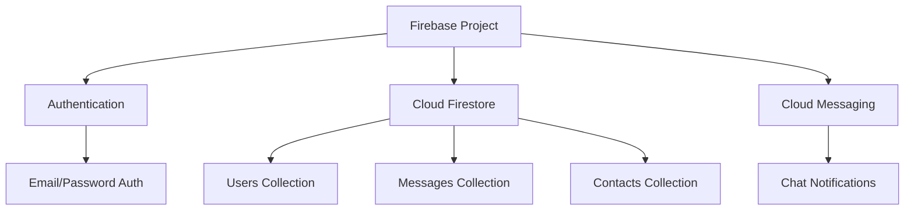
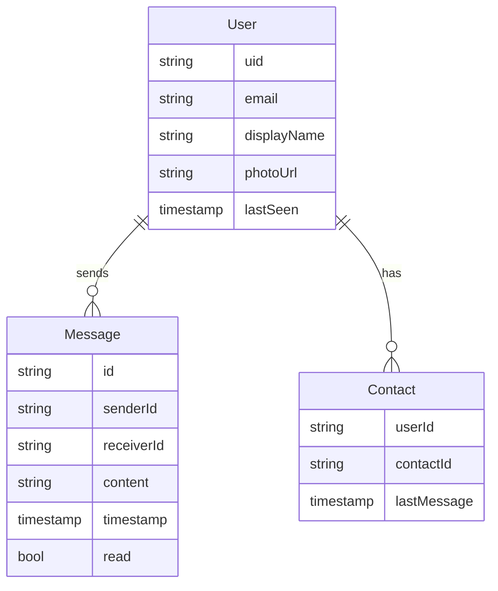

# Chat Application Enhancement Plan

## Overview
This plan outlines the process of enhancing the current notification app into a chat application with one-to-one messaging capabilities and email/password authentication using Firebase.

## 1. Firebase Configuration Updates



### Required Firebase Services
- Firebase Authentication for email/password login
- Cloud Firestore for data storage
- Cloud Messaging (existing) for chat notifications

## 2. Data Model Structure



## 3. Implementation Phases

### Phase 1: Authentication
1. Authentication Setup
   - Add Firebase Auth dependency
   - Configure Firebase Auth in the app
   - Create AuthService class for managing authentication

2. Auth UI Implementation
   - Design and implement login screen
   - Design and implement signup screen
   - Add form validation
   - Implement error handling

3. User Session Management
   - Implement persistent login
   - Add logout functionality
   - Handle auth state changes

### Phase 2: User Management
1. User Profile System
   - Create UserModel class
   - Implement user data storage in Firestore
   - Add profile update functionality

2. Contact Management
   - Implement user search functionality
   - Create contact list view
   - Add contact management features

### Phase 3: Chat Implementation
1. Chat UI Components
   - Chat list screen showing all conversations
   - Chat detail screen for individual conversations
   - Message input field with send button
   - Message bubbles for sent/received messages

2. Message Handling
   - Implement message sending
   - Set up real-time message listening
   - Add message status (sent/delivered/read)
   - Implement message persistence

3. Enhanced Notifications
   - Update notification handling for chat messages
   - Add message preview in notifications
   - Implement notification actions
   - Handle notification taps

### Phase 4: UI/UX Enhancements
1. Visual Improvements
   - Update app theme for chat interface
   - Add animations for message sending/receiving
   - Implement loading states
   - Add pull-to-refresh functionality

2. User Experience
   - Add typing indicators
   - Implement message timestamps
   - Add online/offline status
   - Implement pagination for message history

## 4. New Project Structure
```
lib/
├── auth/
│   ├── auth_service.dart
│   ├── login_page.dart
│   └── signup_page.dart
├── models/
│   ├── user_model.dart
│   ├── message_model.dart
│   └── contact_model.dart
├── pages/
│   ├── chat_list_page.dart
│   ├── chat_detail_page.dart
│   └── profile_page.dart
├── services/
│   ├── firebase_service.dart
│   ├── chat_service.dart
│   └── notification_service.dart
└── widgets/
    ├── message_bubble.dart
    ├── chat_input.dart
    └── user_avatar.dart
```

## 5. Dependencies to Add
```yaml
dependencies:
  firebase_auth: ^latest
  cloud_firestore: ^latest
  cached_network_image: ^latest
  timeago: ^latest
```

## 6. Security Considerations
1. Firestore Security Rules
   ```javascript
   rules_version = '2';
   service cloud.firestore {
     match /databases/{database}/documents {
       // User profiles
       match /users/{userId} {
         allow read: if request.auth != null;
         allow write: if request.auth.uid == userId;
       }
       
       // Messages
       match /messages/{messageId} {
         allow read, write: if request.auth != null
           && (request.auth.uid == resource.data.senderId 
           || request.auth.uid == resource.data.receiverId);
       }
       
       // Contacts
       match /contacts/{contactId} {
         allow read, write: if request.auth != null
           && request.auth.uid == resource.data.userId;
       }
     }
   }
   ```

2. Authentication Rules
   - Enforce strong password requirements
   - Implement email verification
   - Add rate limiting for login attempts

## 7. Testing Strategy
1. Unit Tests
   - Auth service tests
   - Message service tests
   - Data model tests

2. Integration Tests
   - Chat flow testing
   - Notification testing
   - Authentication flow testing

3. UI Tests
   - Widget tests for chat components
   - Screen navigation tests
   - Form validation tests

## 8. Implementation Timeline
1. Phase 1 (Authentication): 2-3 days
2. Phase 2 (User Management): 2-3 days
3. Phase 3 (Chat Implementation): 3-4 days
4. Phase 4 (UI/UX Enhancements): 2-3 days
5. Testing and Bug Fixes: 2-3 days

Total Estimated Time: 11-16 days